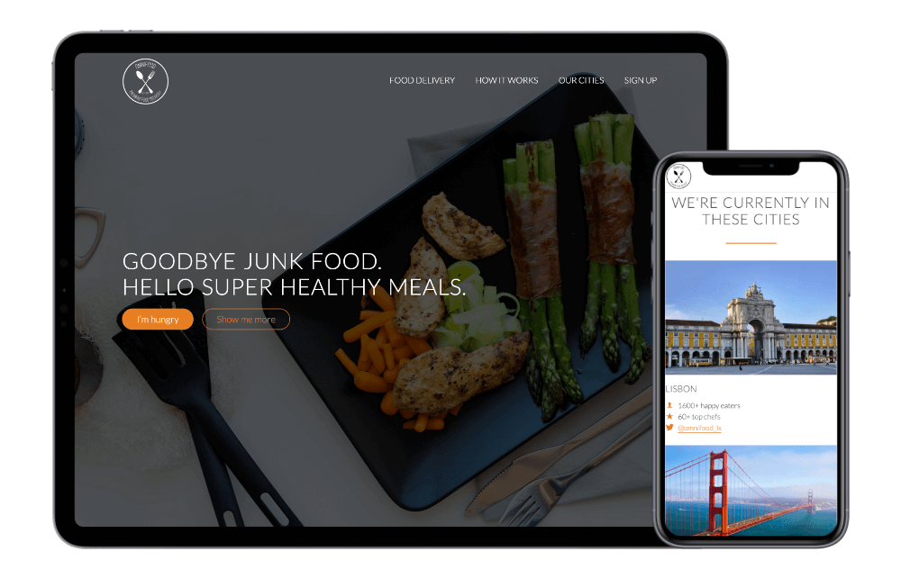

# Omnifood
Practice project from _**Jonas Schmedtmann**_'s Udemy course _[Build Responsive Real World Websites with HTML5 and CSS3](https://www.udemy.com/design-and-develop-a-killer-website-with-html5-and-css3/)
This course included designing, coding, planning, writing clean and organized code, 
website optimization and best practices. 
Step-by-step, I learned more about HTML5 and CSS3 features, from beginner to advanced.

  

